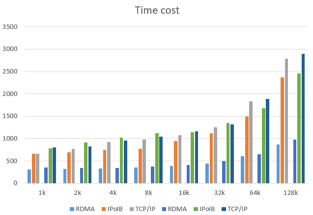

# Performance evaluation of MongoDB with RDMA in Singularity-based container environments

## Intro

During the past decades, there has been a tremendous increase in the number of data intensive applications. For example, Facebook generates above 3 billion pieces of content each day. Therefore , how to deal with the problems coming with large-scale data becomes a crucial issue. The traditional relational database cannot meet the immense data storage and look-up requirements of such massive amount of data.  The NoSQL database movement came about to address the shortcomings of relational database and meet the requirements of data intensive applications. The NoSQL database has been widely deployed as the data center in various applications such as the use of MongoDB in Kuaidi and Google Cloud, HBase in Twitter and Facebook. Among many popular NoSQL databases, MongoDB stands out for its high performance, high availability and automatic scaling, which is also open-source and document-oriented. Former work has already deployed RDMA in MongoDB to achieve a remarkable performance improvement. This work aims to evaluate the performance of origin MongoDB/RDMA based MongoDB in Singularity environment to verify whether Singularity will affect the speed of MongoDB Database.

## Evaluation 

T**he experimental cluster consists of 2 Sugon nodes with dual Intel Xeon E5-2660 processors and 128GB RAM. Each node runs Centos Linux release 7.3.1611. The nodes are connected with both 1 GigE and Mellanox 40G QDR InfiniBand(ConnectX VPI).** 

We use MongoDB 4.0.0 in our experiment. Multi-Servers are deployed as a replica set with four nodes due to our limited nodes, while the clients run on the rest of nodes. 

We use Singularity 3.3.0 in our experiment, which is the latest version of Singualrity and this version has many new features than older versions. Then we choose Centos as the container's operating system as with the host environment.

The workload is generated by YCSB (The Yahoo! Cloud Serving Benchmark) and we implement our own client to bridge the YCSB workload with RDMA based MongoDB. In all experiments, we use 100% Put workload and each workload haves 100,00 operations. 

First of all we evaluate the performance of MongoDB in host environment and Singularity environment without any specific configuration like cgroups, security options, etc. The results were shown in the tables behind.

latency(ms)

| host environment | message size | 1k   | 2k   | 4k   | 8k   | 16k  | 32k  | 64k  | 128k |
| ---------------- | ------------ | ---- | ---- | ---- | ---- | ---- | ---- | ---- | ---- |
|                  | RDMA         | 312  | 317  | 328  | 351  | 388  | 445  | 601  | 871  |
|                  | IPoIB        | 661  | 693  | 742  | 768  | 940  | 1125 | 1494 | 2368 |
|                  | TCP/IP       | 657  | 771  | 926  | 982  | 1076 | 1254 | 1836 | 2788 |

| singularity environment | message size | 1k   | 2k   | 4k   | 8k   | 16k  | 32k  | 64k  | 128k |
| ----------------------- | ------------ | ---- | ---- | ---- | ---- | ---- | ---- | ---- | ---- |
|                         | RDMA         | 351  | 339  | 346  | 379  | 411  | 493  | 649  | 975  |
|                         | IPoIB        | 780  | 916  | 1018 | 1122 | 1142 | 1350 | 1683 | 2462 |
|                         | TCP/IP       | 807  | 820  | 959  | 1041 | 1161 | 1313 | 1892 | 2892 |

According to the tables above we can see that Singularity impose very little influence on the speed of MongoDB Database.

Then we run Singularity with CGROUPS to restrict container resources. First we limit the amount of memory   our container to 500MB. Then We find an interesting result that if memory is insufficient MongoDB will not work due to memory shortage error and if memory is plenty the speed will remain the same as Singularity without CGROUPS restriction. 



**Related command**

```
sudo singularity shell --writable --bind /lib64:/lib64 centos_mongodb
./mongod --dbpath ../data/db --port 27017 --bind_ip 10.0.0.2
./mongo 10.0.0.2:27017 insert.js
```

