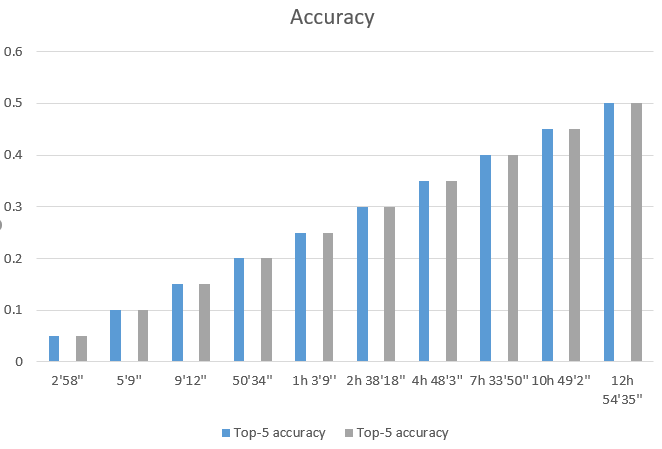

# Performance evaluation of TensorFlow with RDMA in Singularity-based container environments

## Intro

In recent years, Machine Learning has driven advances in many different fields.Moreover, benefiting from the rapid growth of computing power, Deep Learning has drawn wider and wider attention from researchers and engineers. TensorFlow is a numerical computation system designed for Machine Learning, which supports a variety of applications, with a focus on training and inference on deep neural networks. It can efficiently support large-scale training and inference as well as flexibly support experimentation and research into new models and system-level optimizations. 

Previous work has already ported RDMA in Distributed TensorFlow to achieve a better performance and the result is pretty good.However there is a crucial problem for deeplearning researchers that the environment for TensorFlow is hard to deploy and transfer. So the idea comes to our mind that if we can build TensorFlow environment in Singularity, it will be easier for developer to achieve agile development. But there is also a uncertainty whether singularity will limit the performance of TensorFlow, thus it's a necessarily that we make clear if Singularity will do harm to the behavior of TensorFlow.

## Evaluation

The ResNet model is kind of purely Conv-Net, but stands out for its residual building block that provides extra shortcut connections for identity mapping between layers. **The ResNet-50 consists of 49 convolutional layers and contains totally about 25.6 million parameters and about 4 GFLOP computation.** 

We trained ResNet-50 based on **ImageNet which contains 1.28 million natural images** in host environment and Singularity environment respectively and then evaluate their performance. To fully exam whether Singularity will impose influence to communicating patterns of Distributed TensorFlow, **our test environment includes 2 nodes which has 2 Tesla V100 GPU.**

Test environment

```
Host environment = ubuntu18.04
Singularity environment = ubuntu18.04
cudnn = v7.5.0.56
cuda = v10.0.130
bazel = 0.24.1
gcc = 4.8
tensorflow = v1.14.0 built from source

```

Related command

```
export CUDA_VISIBLE_DEVICES='2,3'
TRAIN_FLAGS="
--strategy ps
--task_index 0
--worker_hosts snode1:19977,snode2:19978
--work_mode train
--num_gpus 2
--learning_rate 0.01
--optimizer rmsprop
--batch_size 128
"
dist_dir="./logs/dist/"
python imagenet_train.py ${TRAIN_FLAGS} > ${dist_dir}ps_train_2g_rmsp.log 2>&1 &

```


| Host environment |                |
| ---------------- | -------------- |
| Time cost        | Top-5 accuracy |
| 2'58''           | 0.05           |
| 5'9''            | 0.1            |
| 9'12''           | 0.15           |
| 50'34''          | 0.20           |
| 1h 3'9''         | 0.25           |
| 2h 38'18''       | 0.30           |
| 4h 48'3''        | 0.35           |
| 7h 33'50''       | 0.40           |
| 10h 49'2''       | 0.45           |
| 12h 54'35''      | 0.50           |

| Singularity environment |                |
| ----------------------- | -------------- |
| Time cost               | Top-5 accuracy |
| 2'49''                  | 0.05           |
| 5'24''                  | 0.1            |
| 10'01''                 | 0.15           |
| 51'45''                 | 0.20           |
| 1h 5'2''                | 0.25           |
| 2h 34'40''              | 0.30           |
| 4h 49'43''              | 0.35           |
| 7h 36'19''              | 0.40           |
| 10h 47'41''             | 0.45           |
| 12h 58'48''             | 0.50           |

According to the two tables above, we can see that Singularity also have little influence in the training process in TensorFlow deeplearning framework. And since that we can draw the conclusion that using Singularity to achieve mobility.

