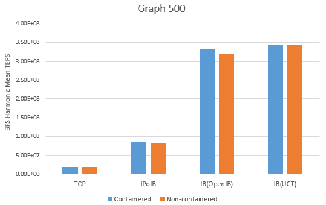

# Performance of MPI Applications in Singularity-based container environments

## Abstract

The performance impact on virtualization is always important when it comes to HPC applications. In the following article, we'll illustrate our works on Singularity and Graph500, which is likely to represent typical performance cost under containered virtualization solutions like Singularity and Docker, together with MPI based HPC applications. Through our tests, we've come to a conclusion that under proper configurations, the performance loss for those applications in containered environments is negligible compared to normal environment setup.

## Evaluation

### Software Versions during evaluation

- Graph500 v3.0.0, running *graph500_reference_bfs* (Compiled by GCC 8.3.0)
  - Running problem size 26.
- Singularity v3.3.0
  - Latest Ubuntu Sandbox (18.10 cosmic)
- OpenMPI v4.0.1 (Compiled by GCC 4.8.5)

> To obtain GCC versions, `strings -a graph500_reference_bfs | grep GCC` and `ompi_info` is used.

### Methods of communication

To show the impact of virtualization on HPC applications, different methods of communication is involved in the test:

- TCP (via 1Gbps Ethernet)
  - OpenMPI BTL: TCP
- TCP IPoIB (via Mellanox mlx_4, 40Gbps QDR)
  - OpenMPI BTL: TCP
- Infiniband
  - OpenMPI BTL: UCT
  - OpenMPI BTL: OpenIB

### Environment Setup

We'll illustrate how to setup containered environments in the following paragraph.

1. Install Singularity
2. Pull out ubuntu base image, use `singularity shell` to enter in the environment
   - Notice: only PID namespaces is needed, no network namespaces required (or performance degrade will happen, and **that is not what it meant to be**)
3. Install necessary components (GCC, binutils, etc.) used to build Graph500
4. Build Graph500
5. Use *bind mount* feature provided by Singularity to mount OpenMPI (Better installed in a separate prefix, or this may conflict with the existing containered environment) and `/lib64` in
   - Except for mounting the entire `/lib64` in, putting OFED RDMA user libraries in separately can also be a choice;
   - Or we can use `mpirun singularity exec container_name` to move MPI implementations out of the pack, but we didn't try this in our test configuration.
6. Run `sshd` in containers to be connected to, use a different port to avoid conflict with existing host ports (Port 22)
   - Then OpenMPI will have trouble communicating since it relies on running `ssh node_x` stuff directly, so put `Host ... Port ...` configurations in `~/.ssh/config` every containers to be tested, as well as in `/etc/hosts` for a separate hostname to be used in OpenMPI hostfile.
7. Run tests by using the following:
   - TCP: `mpirun --mca btl '^openib,ucx' --mca btl_tcp_if_include enp4s0f0 --hostfile ./tcphostfile -np 64 ./graph500_reference_bfs 26`
     - in *tcphostfile* we uses IP address bound to Ethernet cards, and *btl_tcp_if_include* can force OpenMPI to use the specified network interface.
     - `--mca btl '^openib,ucx'` can exclude *openib* and *ucx* byte transfer layer.
   - OpenIB: `mpirun --mca btl '^tcp' --mca btl_openib_allow_ib true --hostfile hostfile_ib_bare -np 64 ./graph500_reference_bfs 26`
     - A separate OpenMPI, not containing UCX support is used. using `--mca btl '^tcp,ucx'` is also feasible.
   - IPoIB: `mpirun --mca btl '^openib,ucx' --mca btl_tcp_if_include ib0 --hostfile hostfile_ib_bare -np 64 ./graph500_reference_bfs 26`
   - UCX (UCT): `mpirun --mca btl '^tcp,openib' --hostfile hostfile_ib_bare -np 64 ./graph500_reference_bfs 26`

### Error elimination

We've used a handmade script to monitor the CPU usage during the entire test. It wakes up at a regular interval (15s), using `ssh` to login and `ps aux` to record the CPU usage. Then, another script is used to determine the shares of CPU used by Graph500 and all other applications.

### Result

Two nodes, each 32 processes are used (硬件部分todo) . *BFS Harmonic Mean TEPS* are used to measure the performance.

|             | Containered | Non-containered |
| ----------- | ----------- | --------------- |
| TCP         | 1.92E+07    | 1.91E+07        |
| IPoIB       | 8.59E+07    | 8.27E+07        |
| IB (OpenIB) | 3.31E+08    | 3.19E+08        |
| IB (UCT)    | 3.44E+08    | 3.42E+08        |

