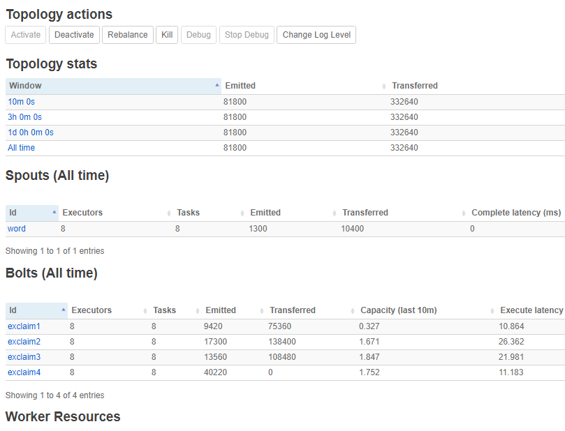

# Apache Storm RDMA Operation Guide

## Installation

> In *Installation* chapter, both DiSNI and JXIO are described.
>
> However, in practical you may want only one of them. Sort out if necessary.

### Prerequisite

- Maven (Tested working on v3.6.2)
  - Switching to Aliyun Maven Central Mirror can greatly increase the speed to download required pom files in China Mainland.
- OpenJDK 1.8.0
- Proper toolchain to compile `libdisni` JNI interface (GCC, etc.)

### DiSNI

A modified version of DiSNI is used in this program, forked from the official v2.1.

1. Pull out sources

   - Either extract `disni-2.1-modified.tar.gz` shipped with our report
   - Or use `git clone https://github.com/libreliu/disni && cd disni && git switch 2.1-modified` 

2. Build & install libdisni

   ```shell
   # SPECIFY YOUR PATH TO JDK USING --with-jdk=<path> here
   cd libdisni; ./autoprepare.sh; ./configure --with-jdk=<path>; make install
   ```

3. Build and install DiSNI to maven local repository

   ```shell
   cd .. # SWITCH BACK TO WHERE pom.xml contains
   mvn clean install
   ```

4. (Optional) Test if DiSNI really works

   - See DiSNI's `README.md`  for more info.

### JXIO

1. Pull out JXIO sources

   - Extract `JXIO.zip`

2. Run following

   ```shell
   cd JXIO
   # Eg. /usr/lib/jvm/jre-1.8.0-openjdk-1.8.0.222.b10-0.el7_6.x86_64
   export JAVA_HOME=<your_path_to_jre>
   ./build.sh
   cd bin
   # Install into Maven local repository
   mvn install:install-file -Dfile=./jxio.jar -DgroupId=org.accelio -DartifactId=jxio -Dversion=1.3 -Dpackaging=jar
   ```

### Zookeeper

1. Download [Zookeeper 3.4.14](http://zookeeper.apache.org/releases.html) from Apache Zookeeper website

   > Higher version of Zookeeper (>=3.5) have a built-in web console enabled at 8080 by default.
   >
   > Special configuration in `zoo.cfg` is necessary for 3.5 users, since Storm UI will also bind to that port.
   
2. Configure Zookeeper

   ```shell
   cd zookeeper-3.4.5/conf
   vim zoo.cfg
   ```
   
   An example `zoo.cfg`:
   
   ```sh
   tickTime=2000
   dataDir=/tmp/zoo_tmp
   clientPort=2181
   initLimit=5
   syncLimit=2
   server.1=mynode1:2888:3888        # 2888 is for messaging, 3888 is for delegation
   server.2=mynode2:2888:3888        # mynode* is the servers to deploy zookeeper cluster
   server.3=mynode3:2888:3888        # (Put mynode* or other hosts bindings in /etc/hosts first!)
   ```

3. Create file of ID in *dataDir*

   ```shell
   cd /tmp/zoo_tmp
   echo 1 > myid
   ssh mynode2
   cd /tmp/zoo_tmp
   echo 2 > myid
   ...
   ```

4. Start Zookeeper (In every node)

   ```shell
   ./bin/zkServer.sh start
   ssh mynode2
   ./bin/zkServer.sh start
   ...
   ```

> To check status for one particular Zookeeper server, run `./bin/zkCli.sh -server mynodeX  2181` and try `ls` in the session. Zookeeper nodes will be listed like files, if everything is all right.

### Storm (DiSNI)

DiSNI ver. Storm is based on Apache Storm v2.0.0, the official release.

1. Pull out sources
   - Either extract `apache-storm-v2.0.0-src-with-disni-messaging-plugin.tar.gz` shipped with our report
   - Or use `git clone https://github.com/libreliu/storm && cd storm && git switch storm-rdma`

2. Build & install Storm to local repository

   ```shell
   mvn clean install -DskipTests -Dcheckstyle.skip   # Takes ~5min. when everything downloaded
   ```

3. Generate Storm Binary Package

   ```shell
   cd storm-dist/binary
   mvn clean package -DskipTests -Dcheckstyle.skip -Dgpg.skip
   ```

   When done, `storm-dist/binary/final-package/target/apache-storm-v2.0.0.tar.gz` should be available.

4. Extract and start Storm Nimbus, UI and Supervisor

   ```shell
   # Assumed you've extracted apache-storm-v2.0.0.tar.gz to ~/storm
   vim ~/storm/conf/storm.yaml
   ```

   ```yaml
   storm.zookeeper.servers:
        - "mynode1"                       # Below are the Zookeeper servers you've previously set up
        - "mynode2"
   storm.zookeeper.port: 2181            # Zookeeper client port
   nimbus.seeds: ["mynode1"]             # The node(s) to run Storm Nimbus
                                         # type things like ["a", "b"] if you want multiple nimbus
    
   # The following filter configurations are used to bind the correct IP for DiSNI messaging plugin.
   storm.messaging.disni.binding.filter.enable: true  # Controls if we'll enable the plugin
   storm.messaging.disni.binding.filter.list:         # Controls the list to be filtered out
       - "vir"
       - "docker"
       - "tun0"
   
   # When true, only interfaces whose name is in filter list will be discarded.
   # When false, interfaces that contains strings in the list will also be discarded.
   storm.messaging.disni.binding.filter.strict: false
   
   # This is used to control how many recv Verbs call shall be initiated during new client arrive
   # Setting this too low will experience WC status 13 on client side
   # Will consume (recv.call.initialized) * (recv.buffer.size) bytes of mem, so setting too high means you need to adjust worker.heap.memory.mb to meet the memory requirements
   storm.messaging.disni.recv.call.initialized: 25 
   storm.messaging.disni.recv.buffer.size: 1048576
   worker.heap.memory.mb: 4096
   
   # Use which messaging plugin
   storm.messaging.transport: "org.apache.storm.messaging.disni.Context"
   
   # Accumulate buffer.size of tuples before handing them to the messaging plugin
   topology.transfer.buffer.size: 32000
   ```

   ```shell
   ~/storm/bin/storm nimbus &        # In mynode1
   ~/storm/bin/storm ui &
   ~/storm/bin/storm supervisor &
   ssh mynode2
   ~/storm/bin/storm supervisor &
   jps                               # Monitor if everything works
   ```

5. Submit a topology for test (Eg. ExclamationTopology)

   ```shell
   cd example/                       # in ~/storm
   cd storm-starter/
   mvn clean package -Dcheckstyle.skip=true -DskipTests
   cd target
   storm jar ./storm-starter-*.jar org.apache.storm.starter.ExclamationTopology    # Submit the topology
   ```

6. Open browser, enter `http://mynode1:8080`

   

   

### Storm (JXIO)

JXIO ver. Storm is based on Apache Storm v2.0.1, the official release.

1. Pull out sources

   - Extract `apache-storm-v2.0.1-src-with-jxio-messaging-plugin.tar.gz.zip` shipped with our report

2. Build & install Storm to local repository

   ```shell
   mvn clean install -DskipTests -Dcheckstyle.skip   # Takes ~5min. when everything downloaded
   ```

3. Generate Storm Binary Package

   ```shell
   cd storm-dist/binary
   mvn clean package -DskipTests -Dcheckstyle.skip -Dgpg.skip
   ```

   When done, `storm-dist/binary/final-package/target/apache-storm-v2.0.1-SNAPSHOT.tar.gz` should be available.

4. Extract and start Storm Nimbus, UI and Supervisor

   ```shell
   # Assumed you've extracted apache-storm-v2.0.1-SNAPSHOT.tar.gz to ~/storm
   vim ~/storm/conf/storm.yaml
   ```

   ```sh
   storm.zookeeper.servers:
        - "mynode1"
        - "mynode2"
    storm.zookeeper.port: 2181
    nimbus.seeds: ["mynode1"]
    
    # Choose JXIO Context
    storm.messaging.transport: "org.apache.storm.messaging.zzy_JXIO.Context"
    topology.transfer.buffer.size: 32000
   ```

   ```sh
   ~/storm/bin/storm nimbus &
   ~/storm/bin/storm ui &
   ~/storm/bin/storm supervisor &
   # ~/storm/bin/storm logviewer &    # (Optional) Do this in each node if you want log viewing in Storm UI directly
   ssh mynode2
   # ~/storm/bin/storm logviewer &    # (Optional) Do this in each node if you want log viewing in Storm UI directly
   ~/storm/bin/storm supervisor &
   jps
   ```

5. Submit a topology for test (Eg. ExclamationTopology)

   > Note: If you want our version of ExclamationTopology (which sends more strings at one time & create more workers), replace `ExclamationTopology.java` with [the one provided in the repo](../TestTopology/ExclamationTopology.java).
   >
   > The one provided in the contest tarball may have been replaced by our version. `git diff` when in doubt.

   ```shell
   cd example/                       # in ~/storm
   cd storm-starter/
   mvn clean package -Dcheckstyle.skip=true -DskipTests
   cd target
   storm jar ./storm-starter-*.jar org.apache.storm.starter.ExclamationTopology    # Submit the topology
   ```

6. Open browser, enter `http://mynode1:8080`

   


## Testing

See [disni-plugin-tester](https://github.com/libreliu/disni-plugin-tester) for DiSNI Testers.

